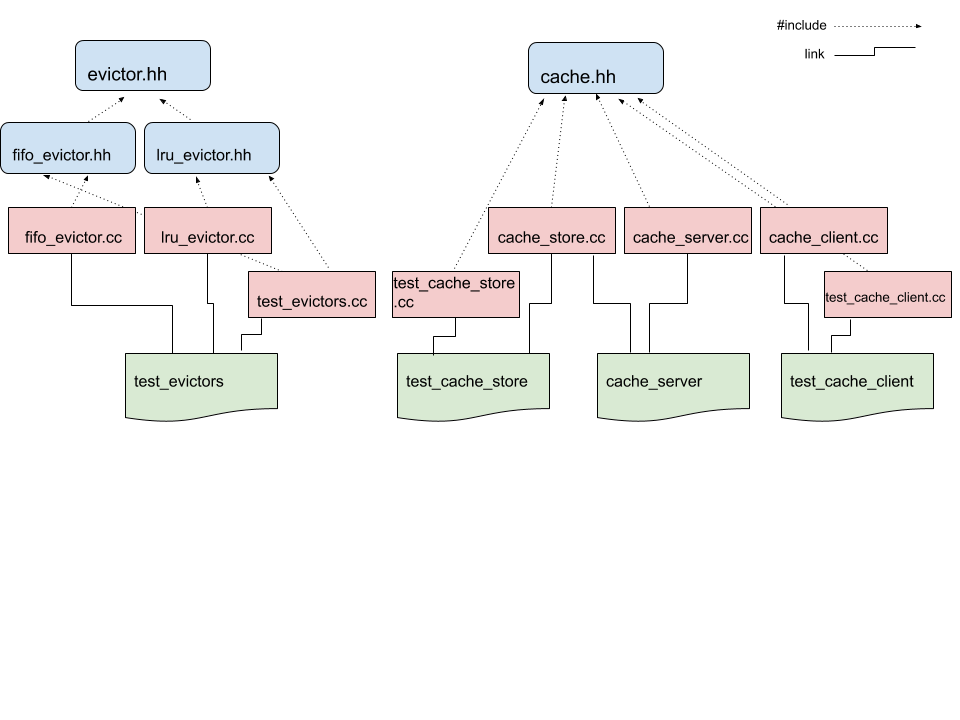

cs389-cache
===
A networked in-memory cache written with Boost.Beast in C++ for CSCI
389 (Computer Systems) at Reed College.

The architecture is approximated by the following diagram:

Build
===
Install the dependencies:
* The Boost library. This should include beast, the http
  library we're using here. On Arch: `pacman -S boost`.
* The Catch2 framework. On Arch: `pacman -S catch2`. You can also
  download the amalgamated header and include it manually. See the
  [tutorial](https://github.com/catchorg/Catch2/blob/devel/docs/tutorial.md)
  for details.

Run `make` to build everything. You should see 3 executables: 
* `cache_server` is the cache itself. Run with `-h` to see the
  options. By default it listens on localhost:42069 and has a maximum
  allowable cache size of about 64K. The `-t` option to specify the
  number of threads won't do anything as we never got it working
  reliably.
* `test_cache_client` is a cache client that tests a running server
  using the Catch framework.
* `test_cache_store` is only tests the cache library defined in
  `cache_store.cc` and `cache.hh` it also makes use of the Catch
  framework.

The architecture diagram makes reference to a `test_evictors`
executable and lru_evictor header and source files, however we didn't
end up writing those. The only eviction policy currently implemented
is a FIFO evictor.
  
Run the Test
===
To test the server; in one terminal run `./cache_server`, and in
another run `./test_cache_client`.

To test the cache library itself, just run `./test_cache_store`. 

Both test should print, in green: `All tests passed`. If not then
you're either doing something wrong or Boost is being a pita again and
I feel your pain.
